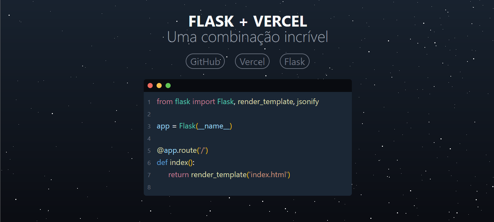

  
# Flask + Vercel

Deploy your `Flask` website to the `Vercel` plataform 100% free

 
 

## Articles

- **[DEV Communit]** [How to deploy a Python/Flask App to Vercel](https://dev.to/andrewbaisden/how-to-deploy-a-python-flask-app-to-vercel-2o5k)
- **[Matías Fuentes Blog]** [How to Deploy a Flask Web App on Vercel](https://matiasfuentes.hashnode.dev/how-to-deploy-a-flask-web-app-on-vercel)